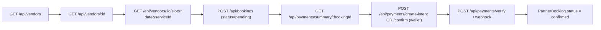

# Pawffy Backend – Unified Booking & Payment Flow

> One booking flow for every service type. Verified against the codebase
> (`routes/`, `controllers/`, `services/`, `validators/`, `prisma/schema.prisma`).

## Overview

There is a **single booking system**. Every service — vet, grooming, walking, training,
boarding, sitting, transport, poop_scooper — is a `PartnerService` (with a `serviceType`)
offered by a `PartnerBusiness` (provider), and every booking is a `PartnerBooking`.

| Concept | Model |
|---------|-------|
| Provider | `PartnerBusiness` (owned by a `partner` user) |
| Service | `PartnerService` (`serviceType`, `durationMinutes`, `price`) |
| Booking | `PartnerBooking` |
| Payment | `Payment` (1:1 with `PartnerBooking`) |

**Pay-to-confirm:** a booking is created `pending` and becomes `confirmed` only after the
customer completes payment (Stripe or wallet). Vendors receive already-confirmed bookings
in their inbox and can decline, but do not manually accept.



### Conventions

- **Base URL:** `http://localhost:5001/api` (dev; default `PORT` is `5001`).
- **Auth header (protected routes):**
  ```
  Authorization: Bearer <APP_JWT>
  Content-Type: application/json
  ```
- The `APP_JWT` comes from `POST /api/auth/session` (step 0).

---

## 0. Authentication

Supabase-based: log in with Supabase on the client to get a Supabase `accessToken`, then
exchange it for the app JWT.

**`POST /api/auth/session`** — no auth header

```json
{ "accessToken": "<supabase_access_token>", "name": "John Doe", "email": "john@example.com" }
```

**Response (200):**
```json
{
  "success": true,
  "message": "Signed in successfully",
  "data": {
    "user": { "id": "user-uuid", "name": "John Doe", "email": "john@example.com", "role": "customer" },
    "token": "<APP_JWT>"
  }
}
```

---

## 1. Discovery (providers, services, slots)

### 1.1 List providers
**`GET /api/vendors`** (public) — supports discovery query params.

### 1.2 Provider details (with services)
**`GET /api/vendors/:vendorId`** (public) — returns the business profile and its active `PartnerService`s.

### 1.3 Available slots
**`GET /api/vendors/:vendorId/slots`** (public)

**Query:**
| Param | Required | Notes |
|-------|----------|-------|
| `date` | ✅ | `YYYY-MM-DD` |
| `serviceId` | ❌ | UUID; uses the service's `durationMinutes` for the slot grid |
| `slotDurationMinutes` | ❌ | integer 10–240, default 30 (ignored when `serviceId` is given) |

**Response (200):**
```json
{
  "success": true,
  "data": {
    "date": "2026-12-25",
    "vendorId": "vendor-uuid",
    "slotDuration": 30,
    "sameDayRequests": false,
    "slots": [
      { "time": "09:00", "available": true },
      { "time": "09:30", "available": false }
    ]
  }
}
```
- Empty `slots: []` if the provider has no availability window for that weekday.
- Blocked dates / booked slots / same-day rules set `available: false`.

---

## 2. Booking

All routes are under `/api/bookings` and require `Authorization: Bearer <APP_JWT>`.
Creation and cancellation require the `customer` role.

### 2.1 Create a booking
**`POST /api/bookings`** (customer) · write limiter

**Request Body:**
```json
{
  "vendorId": "vendor-uuid",
  "serviceId": "service-uuid",
  "petId": "pet-uuid",
  "bookingDate": "2026-12-25",
  "bookingTime": "14:30",
  "location": "123 Main St, New York",
  "notes": "Pet needs a bath and nail trim"
}
```
- `bookingTime` accepts `HH:MM` or `HH:MM AM/PM`.
- Validates: provider verified, service active & owned by provider, pet owned by caller,
  and slot available. Price is resolved from the service and stored on the booking.

**Response (201):**
```json
{
  "success": true,
  "message": "Booking created",
  "data": {
    "id": "booking-uuid",
    "businessId": "vendor-uuid",
    "customerId": "user-uuid",
    "petId": "pet-uuid",
    "serviceId": "service-uuid",
    "serviceName": "Full Grooming Package",
    "petName": "Buddy",
    "petBreed": "Golden Retriever",
    "petAge": "3",
    "petImageUrl": "https://...",
    "bookingDate": "2026-12-25T00:00:00.000Z",
    "bookingTime": "14:30",
    "location": "123 Main St, New York",
    "price": "8500",
    "status": "pending",
    "servicePhase": "not_started",
    "notes": "Pet needs a bath and nail trim",
    "isNew": true,
    "createdAt": "2026-07-16T10:30:00.000Z",
    "updatedAt": "2026-07-16T10:30:00.000Z",
    "customer": { "id": "user-uuid", "name": "John Doe", "profileImage": "https://..." }
  }
}
```

**Errors:** `404` vendor / service / pet not found · `403` vendor not approved · `409` slot already booked / not available.

### 2.2 My bookings
**`GET /api/bookings`** (auth) · optional `?status=pending|confirmed|completed|cancelled|rejected`

Returns the caller's bookings (all service types), ordered by `bookingDate` desc, each with
`business`, `service`, and `payment` (`paymentStatus, amount, paymentMethod`).

### 2.3 Booking details
**`GET /api/bookings/:id`** (auth, owner)

Returns the booking with `business`, `service`, full `payment`, plus computed
`appointmentId` and `dateTimeFormatted`.

### 2.4 Cancel a booking
**`PATCH /api/bookings/:id/status`** (customer, owner)

```json
{ "status": "cancelled" }
```
Only the owner may cancel, and only if the booking is `pending` or `confirmed`
(`completed` / `cancelled` / `rejected` return `409`).

---

## 3. Payment

All routes under `/api/payments` require `Authorization: Bearer <APP_JWT>` (except the webhook).
Payment operates on `PartnerBooking`; the service price is taken from the booking's stored `price`.

Pricing (`constants/pricing.js`): platform fee `5`, tax `5%`, paw points `1×` total.
`tax = (price − discount + 5) × 0.05` · `total = price − discount + 5 + tax`

### 3.0 Config
**`GET /api/payments/config`**
```json
{ "success": true, "data": { "publishableKey": "pk_test_...", "currency": "inr", "paymentMethods": ["card", "net_banking"] } }
```

### 3.1 Price summary
**`GET /api/payments/summary/:bookingId`** · optional `?coupon=SAVE10`
```json
{
  "success": true,
  "data": {
    "serviceName": "Full Grooming Package",
    "servicePrice": 8500,
    "platformFee": 5,
    "tax": 425.25,
    "taxRate": "5%",
    "discount": 0,
    "coupon": null,
    "total": 8930.25,
    "pawPoints": 8930
  }
}
```

### 3.2 Apply coupon
**`POST /api/payments/apply-coupon`**
```json
{ "bookingId": "booking-uuid", "code": "SAVE10" }
```
```json
{ "success": true, "message": "Coupon applied", "data": { "code": "SAVE10", "discount": 850, "newTotal": 8037.75, "pawPoints": 8037 } }
```

### 3.3 Create payment intent (Stripe)
**`POST /api/payments/create-intent`**
```json
{ "bookingId": "booking-uuid", "paymentMethod": "card", "couponCode": "SAVE10" }
```
- `paymentMethod`: `card` | `net_banking`.
```json
{
  "success": true,
  "data": {
    "clientSecret": "pi_..._secret_...",
    "paymentIntentId": "pi_...",
    "amount": 8037.75,
    "amountMinor": 803775,
    "currency": "inr",
    "summary": { "serviceName": "Full Grooming Package", "servicePrice": 8500, "platformFee": 5, "tax": 382.75, "discount": 850, "total": 8037.75, "pawPoints": 8037 }
  }
}
```
- `amount` is major units; `amountMinor` is the paise amount sent to Stripe.
- Creates/updates the `Payment` row (`paymentStatus: "pending"`, `transactionId = paymentIntentId`).
- Card confirmation happens **client-side** with Stripe's SDK using `clientSecret`.

**Errors:** `409` already paid · `503` Stripe not configured.

### 3.4 Wallet payment
**`POST /api/payments/confirm`** — requires `WALLET_PAYMENTS_ENABLED=true` (else `503`).
```json
{ "bookingId": "booking-uuid", "couponCode": "SAVE10" }
```
Debits the wallet, marks the payment `paid`, and sets the booking `confirmed` in one transaction.
```json
{
  "success": true,
  "message": "Wallet payment confirmed! Booking is now confirmed.",
  "data": {
    "booking": { "id": "booking-uuid", "status": "confirmed", "appointmentId": "APT...", "dateTimeFormatted": "25 Dec 2026, 14:30", "business": { "id": "vendor-uuid", "businessName": "Happy Grooming" }, "service": { "name": "Full Grooming Package", "price": "8500" } },
    "payment": { "id": "payment-uuid", "amount": "8037.75", "paymentMethod": "wallet", "paymentStatus": "paid", "pawPoints": 8037, "paidAt": "2026-07-16T10:35:00.000Z" }
  }
}
```

### 3.5 Verify Stripe payment
**`POST /api/payments/verify`**
```json
{ "paymentIntentId": "pi_..." }
```
```json
{
  "success": true,
  "data": { "stripeStatus": "succeeded", "paymentStatus": "paid", "bookingStatus": "confirmed", "bookingId": "booking-uuid", "appointmentId": "APT..." }
}
```

### 3.6 Payment by booking
**`GET /api/payments/booking/:bookingId`** — returns the `Payment` row with an embedded booking summary.

### 3.7 Stripe webhook
**`POST /api/payments/webhook`** — raw body, header `stripe-signature`.
- `payment_intent.succeeded` → finalize payment (`paid`) + booking `confirmed` (or wallet top-up credit).
- `payment_intent.payment_failed` → payment `failed`.

---

## 4. Booking status lifecycle

`PartnerBookingStatus`: `pending`, `confirmed`, `completed`, `cancelled`, `rejected`.

| Status | Meaning |
|--------|---------|
| `pending` | Created, awaiting payment |
| `confirmed` | Payment completed |
| `completed` | Service finished (set by the vendor app) |
| `cancelled` | Cancelled by the customer |
| `rejected` | Declined by the provider |

- Payment finalization (`verify` / webhook / wallet confirm) moves `pending → confirmed`.
- Customers cancel their own booking via `PATCH /api/bookings/:id/status`.
- The provider-side vendor app handles service phases (`started`, `in_progress`, `completed`) and can decline.

---

## 5. Auth & roles

**Header:** `Authorization: Bearer <APP_JWT>`

**Roles** (`enum Role`): `customer`, `admin`, `partner`, `vet`. Providers are `partner` users
that own a `PartnerBusiness`.

| Endpoint | Auth | Role |
|----------|------|------|
| `GET /api/vendors[...]`, `.../slots` | public | — |
| `POST /api/bookings` | ✅ | `customer` |
| `GET /api/bookings`, `GET /api/bookings/:id` | ✅ | owner |
| `PATCH /api/bookings/:id/status` | ✅ | `customer` (owner) |
| `/api/payments/*` (except webhook) | ✅ | booking owner |

---

## 6. Data models (key fields)

### PartnerBooking (`partner_bookings`) — the one booking
```
id, business_id, customer_id, pet_id?, service_id?, service_name, pet_name?, pet_breed?,
pet_age?, pet_image_url?, booking_date (Date), booking_time (String), location?, price (Decimal),
status (enum, default pending), service_phase (enum, default not_started), notes?, is_new,
responded_at?, started_at?, in_progress_at?, completed_at?, progress_data?, ..., created_at, updated_at
```

### Payment (`payments`) — 1:1 with PartnerBooking
```
id, booking_id (unique -> partner_bookings), subtotal, platform_fee (default 5), tax_amount,
discount, coupon_code?, amount, paw_points, payment_method? (card|net_banking|wallet),
payment_status (enum: pending|paid|failed|refunded), transaction_id? (Stripe pi_ id), paid_at?, created_at
```

### PartnerBusiness (`partner_businesses`) / PartnerService (`partner_services`)
Providers and their services (with `serviceType`, `durationMinutes`, `price`/`minPrice`/`maxPrice`).
Availability lives in `PartnerAvailability`; blackout days in `PartnerBlockedDate`.

---

## 7. Quick reference

```
POST   /api/auth/session                  - Exchange Supabase token for app JWT

GET    /api/vendors                        - List providers (public)
GET    /api/vendors/:vendorId              - Provider + services (public)
GET    /api/vendors/:vendorId/slots        - Available slots (public)

POST   /api/bookings                       - Create booking (customer)
GET    /api/bookings                        - My bookings
GET    /api/bookings/:id                    - Booking details
PATCH  /api/bookings/:id/status             - Cancel (customer, owner)

GET    /api/payments/config                 - Stripe config
GET    /api/payments/summary/:bookingId     - Price summary
POST   /api/payments/apply-coupon           - Apply coupon
POST   /api/payments/create-intent          - Create Stripe intent
POST   /api/payments/confirm                - Wallet payment
POST   /api/payments/verify                 - Verify Stripe payment
GET    /api/payments/booking/:bookingId     - Payment by booking
POST   /api/payments/webhook                - Stripe webhook
```
